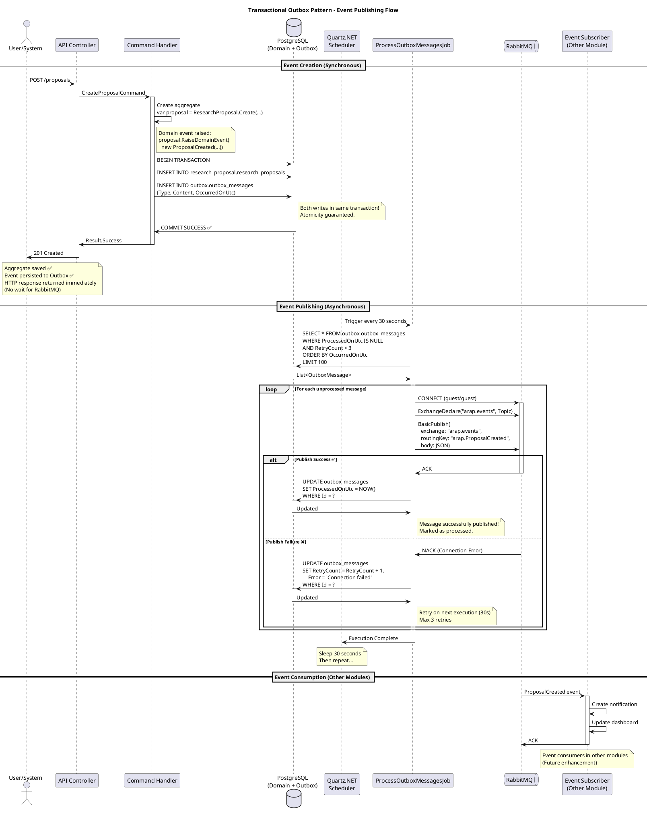

# Transactional Outbox Pattern Implementation

## Overview

The Transactional Outbox Pattern ensures **reliable messaging** and **eventual consistency** across bounded contexts in the Academic Research Assistant Portal (ARAP). It solves the dual-write problem where domain events must be both persisted to the database and published to the message broker atomically.

---

## The Problem: Dual-Write

### Without Outbox Pattern ❌

```csharp
// ❌ PROBLEMATIC CODE
public async Task Handle(CreateProposalCommand command)
{
    // Write to database
    var proposal = ResearchProposal.Create(...);
    await _repository.AddAsync(proposal);
    await _unitOfWork.SaveChangesAsync(); // ✅ Committed
    
    // Publish event to RabbitMQ
    await _messageBus.PublishAsync(proposalCreatedEvent); // ❌ FAILS!
    
    // Result: Database has proposal but no event published
    // Other modules never notified!
}
```

**Issues:**
1. **Partial Failure**: Database committed but RabbitMQ publish fails (network/broker down)
2. **Message Loss**: Events disappear if broker unavailable
3. **Inconsistency**: Modules out of sync (proposal exists but Notifications never created)
4. **No Retry**: Failed events lost forever

---

### With Outbox Pattern ✅

```csharp
// ✅ CORRECT IMPLEMENTATION
public async Task Handle(CreateProposalCommand command)
{
    // Single transaction
    using var transaction = await _context.Database.BeginTransactionAsync();
    
    // 1. Save aggregate
    var proposal = ResearchProposal.Create(...);
    await _repository.AddAsync(proposal);
    
    // 2. Save domain events to Outbox table (same transaction!)
    var domainEvents = proposal.GetDomainEvents();
    foreach (var evt in domainEvents)
    {
        var outboxMessage = new OutboxMessage
        {
            Type = evt.GetType().Name,
            Content = JsonSerializer.Serialize(evt),
            OccurredOnUtc = DateTime.UtcNow
        };
        _outboxContext.OutboxMessages.Add(outboxMessage);
    }
    
    await _context.SaveChangesAsync();
    await transaction.CommitAsync(); // ✅ Both saved atomically
    
    // 3. Background job publishes later (see ProcessOutboxMessagesJob)
}
```

**Benefits:**
- ✅ **Atomicity**: Events saved in same transaction as aggregate
- ✅ **Reliability**: Events never lost (persisted in database)
- ✅ **Retry Logic**: Failed publishes retried automatically
- ✅ **Eventual Consistency**: Events published when broker available

---

## Architecture Components

### 1. OutboxMessage Entity

**Location:** `src/BuildingBlocks/ARAP.Infrastructure.Outbox/OutboxMessage.cs`

```csharp
public class OutboxMessage
{
    public Guid Id { get; set; }
    public string Type { get; set; }        // Event class name
    public string Content { get; set; }      // JSON serialized event
    public DateTime OccurredOnUtc { get; set; }
    public DateTime? ProcessedOnUtc { get; set; }
    public int RetryCount { get; set; }
    public string? Error { get; set; }
}
```

**Database Schema:**
- **Table**: `outbox.outbox_messages`
- **Index**: `IX_outbox_messages_ProcessedOnUtc` (query performance)
- **Lifecycle**: Created → Processed → Retained for audit

---

### 2. OutboxDbContext

**Location:** `src/BuildingBlocks/ARAP.Infrastructure.Outbox/OutboxDbContext.cs`

```csharp
public class OutboxDbContext : DbContext
{
    public DbSet<OutboxMessage> OutboxMessages { get; set; }
    
    protected override void OnModelCreating(ModelBuilder modelBuilder)
    {
        modelBuilder.HasDefaultSchema("outbox");
        
        modelBuilder.Entity<OutboxMessage>(entity =>
        {
            entity.ToTable("outbox_messages");
            entity.HasKey(e => e.Id);
            entity.HasIndex(e => e.ProcessedOnUtc);
            entity.Property(e => e.Type).HasMaxLength(255);
            entity.Property(e => e.Content).HasColumnType("jsonb");
        });
    }
}
```

**PostgreSQL JSONB:**
- Native JSON storage for efficient querying
- Can query event properties if needed (future enhancement)

---

### 3. ProcessOutboxMessagesJob (Quartz.NET)

**Location:** `src/BuildingBlocks/ARAP.Infrastructure.Outbox/ProcessOutboxMessagesJob.cs`

**Purpose:** Background job that polls Outbox table and publishes events to RabbitMQ.

```csharp
[DisallowConcurrentExecution] // Prevent overlapping executions
public class ProcessOutboxMessagesJob : IJob
{
    private readonly ILogger<ProcessOutboxMessagesJob> _logger;
    private readonly IConfiguration _configuration;
    private IConnection? _rabbitConnection;
    
    public async Task Execute(IJobExecutionContext context)
    {
        _logger.LogInformation("Starting outbox message processing...");
        
        // 1. Connect to RabbitMQ
        await EnsureRabbitMQConnectionAsync();
        
        // 2. Query unprocessed messages
        var messages = await _outboxContext.OutboxMessages
            .Where(m => m.ProcessedOnUtc == null && m.RetryCount < 3)
            .OrderBy(m => m.OccurredOnUtc)
            .Take(100) // Batch size
            .ToListAsync();
        
        _logger.LogInformation("Found {Count} messages to process", messages.Count);
        
        // 3. Publish each message
        foreach (var message in messages)
        {
            try
            {
                using var channel = _rabbitConnection!.CreateModel();
                
                // Declare topic exchange
                channel.ExchangeDeclare(
                    exchange: "arap.events",
                    type: ExchangeType.Topic,
                    durable: true);
                
                // Publish to routing key based on event type
                var routingKey = $"arap.{message.Type}";
                var body = Encoding.UTF8.GetBytes(message.Content);
                
                channel.BasicPublish(
                    exchange: "arap.events",
                    routingKey: routingKey,
                    body: body);
                
                // Mark as processed
                message.ProcessedOnUtc = DateTime.UtcNow;
                _logger.LogInformation(
                    "Published message {Id} of type {Type}", 
                    message.Id, message.Type);
            }
            catch (Exception ex)
            {
                message.RetryCount++;
                message.Error = ex.Message;
                _logger.LogError(ex, 
                    "Failed to publish message {Id}. Retry {Count}/3", 
                    message.Id, message.RetryCount);
            }
        }
        
        // 4. Save processing results
        await _outboxContext.SaveChangesAsync();
        
        _logger.LogInformation("Outbox processing completed");
    }
    
    private async Task EnsureRabbitMQConnectionAsync()
    {
        if (_rabbitConnection?.IsOpen == true) return;
        
        var factory = new ConnectionFactory
        {
            HostName = _configuration["RabbitMQ:Host"],
            Port = int.Parse(_configuration["RabbitMQ:Port"]),
            UserName = _configuration["RabbitMQ:UserName"],
            Password = _configuration["RabbitMQ:Password"],
            VirtualHost = _configuration["RabbitMQ:VirtualHost"]
        };
        
        _rabbitConnection = await factory.CreateConnectionAsync();
        _logger.LogInformation("RabbitMQ connection established");
    }
}
```

**Key Features:**
- **Polling Interval**: Every 30 seconds (configurable)
- **Batch Processing**: 100 messages per execution (prevents overwhelming broker)
- **Retry Logic**: Up to 3 attempts per message
- **Error Handling**: Failed messages marked with error, retried later
- **Idempotency**: ProcessedOnUtc prevents duplicate processing
- **Connection Reuse**: RabbitMQ connection kept alive between executions

---

### 4. Quartz Scheduler Configuration

**Location:** `src/ApiGateway/ARAP.Api/Program.cs`

```csharp
builder.Services.AddQuartz(q =>
{
    // Configure job
    var jobKey = new JobKey("ProcessOutboxMessagesJob");
    q.AddJob<ProcessOutboxMessagesJob>(opts => opts.WithIdentity(jobKey));
    
    // Configure trigger (every 30 seconds)
    q.AddTrigger(opts => opts
        .ForJob(jobKey)
        .WithIdentity("ProcessOutboxMessagesJob-trigger")
        .WithSimpleSchedule(x => x
            .WithIntervalInSeconds(30)
            .RepeatForever()));
});

builder.Services.AddQuartzHostedService(q => q.WaitForJobsToComplete = true);
```

**Configuration:**
- **Job Type**: `ProcessOutboxMessagesJob`
- **Trigger**: Simple schedule, 30-second interval, repeat forever
- **Hosted Service**: Auto-starts with application
- **Graceful Shutdown**: Waits for jobs to complete before stopping

---

## Sequence Diagram



---

## Event Flow Example

### Scenario: Student Creates Proposal

**1. Command Execution**
```csharp
POST /api/proposals
Body: {
  "studentId": "...",
  "advisorId": "...",
  "title": "AI in Healthcare",
  "abstract": "...",
  "researchQuestion": "..."
}
```

**2. Domain Logic**
```csharp
var proposal = ResearchProposal.Create(studentId, advisorId, title, abstract, question);
// Internally raises ProposalCreated event
```

**3. Database Transaction** (Single COMMIT)
```sql
BEGIN;

-- Insert aggregate
INSERT INTO research_proposal.research_proposals 
(Id, StudentId, AdvisorId, Title, Abstract, ResearchQuestion, State)
VALUES (...);

-- Insert event to outbox
INSERT INTO outbox.outbox_messages
(Id, Type, Content, OccurredOnUtc, ProcessedOnUtc, RetryCount)
VALUES (
  '123e4567-...',
  'ProposalCreated',
  '{"ProposalId":"...","StudentId":"...","OccurredAt":"2026-01-09T..."}',
  '2026-01-09 14:30:00',
  NULL,
  0
);

COMMIT; -- ✅ Both saved atomically
```

**4. Background Job (30 seconds later)**
```
[14:30:30] Starting outbox message processing...
[14:30:30] Found 1 messages to process
[14:30:30] Attempting RabbitMQ connection: Host=localhost, Port=5672, User=guest
[14:30:30] RabbitMQ connection established
[14:30:31] Published message 123e4567-... of type ProposalCreated
[14:30:31] Outbox processing completed
```

**5. RabbitMQ Exchange**
```
Exchange: arap.events (Topic)
Routing Key: arap.ProposalCreated
Body: {"ProposalId":"...","StudentId":"...","OccurredAt":"..."}
```

**6. Event Subscribers** (Future)
```csharp
// Notifications Module
public class ProposalCreatedEventHandler : IConsumer<ProposalCreated>
{
    public async Task Consume(ConsumeContext<ProposalCreated> context)
    {
        var evt = context.Message;
        
        // Create notification for advisor
        var notification = Notification.Create(
            recipientId: evt.AdvisorId,
            type: NotificationType.ProposalSubmitted,
            content: NotificationContent.Create(
                "New Proposal Submitted",
                $"Student {evt.StudentId} submitted a proposal"),
            channel: DeliveryChannel.InApp);
        
        await _notificationRepo.AddAsync(notification);
    }
}
```

---

## Failure Scenarios & Recovery

### Scenario 1: RabbitMQ Down During Event Creation

**What Happens:**
1. User creates proposal → HTTP 201 Created ✅
2. Aggregate saved to database ✅
3. Event saved to Outbox table ✅
4. Background job tries to publish → RabbitMQ unavailable ❌

**Recovery:**
- Event remains in Outbox with `ProcessedOnUtc = NULL`
- Job retries every 30 seconds
- When RabbitMQ recovers, event published automatically
- **Result: Eventual consistency achieved** ✅

---

### Scenario 2: Application Crashes After Publishing

**What Happens:**
1. Event published to RabbitMQ ✅
2. Application crashes before marking `ProcessedOnUtc` ❌
3. On restart, job finds "unprocessed" event
4. Publishes again (duplicate!)

**Solution: Idempotent Event Handlers**
```csharp
// Event handlers must handle duplicates
public async Task Consume(ConsumeContext<ProposalCreated> context)
{
    var evt = context.Message;
    
    // Check if already processed
    var exists = await _notificationRepo.ExistsByRelatedEntityId(evt.ProposalId);
    if (exists)
    {
        _logger.LogWarning("Duplicate event {EventId} ignored", evt.Id);
        return; // Idempotent - no-op
    }
    
    // Create notification...
}
```

**Alternative: Deduplication Table**
```sql
CREATE TABLE outbox.processed_events (
    event_id UUID PRIMARY KEY,
    processed_at TIMESTAMP NOT NULL
);
```

---

### Scenario 3: Event Fails After 3 Retries

**What Happens:**
1. Event published 3 times, all fail (e.g., malformed JSON)
2. `RetryCount = 3` → No more retries
3. Event stuck in Outbox with error message

**Resolution Options:**

**Option A: Manual Intervention**
```sql
-- Find failed events
SELECT * FROM outbox.outbox_messages
WHERE ProcessedOnUtc IS NULL
  AND RetryCount >= 3
ORDER BY OccurredOnUtc DESC;

-- Fix issue, reset retry count
UPDATE outbox.outbox_messages
SET RetryCount = 0, Error = NULL
WHERE Id = '...';
```

**Option B: Dead Letter Queue** (Future Enhancement)
```csharp
if (message.RetryCount >= 3)
{
    // Move to dead letter table for investigation
    await _deadLetterRepo.AddAsync(new DeadLetterMessage
    {
        OriginalMessage = message,
        FailureReason = message.Error
    });
    
    // Mark as "failed" (not "processed")
    message.ProcessedOnUtc = DateTime.UtcNow;
}
```

---

## Performance Considerations

### Database Load

**Query Optimization:**
```sql
-- Index on ProcessedOnUtc for fast filtering
CREATE INDEX IX_outbox_messages_ProcessedOnUtc 
ON outbox.outbox_messages (ProcessedOnUtc)
WHERE ProcessedOnUtc IS NULL;
```

**Batch Size:**
- Current: 100 messages per execution
- Adjust based on throughput needs
- Higher batch = better throughput, higher latency per message

**Cleanup Strategy:**
```sql
-- Delete processed messages older than 30 days (audit retention)
DELETE FROM outbox.outbox_messages
WHERE ProcessedOnUtc IS NOT NULL
  AND ProcessedOnUtc < NOW() - INTERVAL '30 days';
```

---

### RabbitMQ Throughput

**Connection Pooling:**
- Current: Single connection reused across executions
- Alternative: Connection pool for parallel publishing

**Channel Optimization:**
```csharp
// Reuse channel for batch
using var channel = _rabbitConnection!.CreateModel();
channel.ConfirmSelect(); // Enable publisher confirms

foreach (var message in messages)
{
    channel.BasicPublish(...);
}

channel.WaitForConfirmsOrDie(); // Batch confirmation
```

---

## Monitoring & Observability

### Key Metrics

1. **Outbox Depth** (unprocessed messages)
   ```sql
   SELECT COUNT(*) FROM outbox.outbox_messages
   WHERE ProcessedOnUtc IS NULL;
   ```

2. **Processing Lag** (time to publish)
   ```sql
   SELECT 
       AVG(EXTRACT(EPOCH FROM (ProcessedOnUtc - OccurredOnUtc))) AS avg_lag_seconds
   FROM outbox.outbox_messages
   WHERE ProcessedOnUtc IS NOT NULL;
   ```

3. **Failure Rate**
   ```sql
   SELECT 
       COUNT(*) FILTER (WHERE RetryCount >= 3) AS failed,
       COUNT(*) AS total,
       ROUND(100.0 * COUNT(*) FILTER (WHERE RetryCount >= 3) / COUNT(*), 2) AS failure_rate_pct
   FROM outbox.outbox_messages;
   ```

### Structured Logging

```csharp
_logger.LogInformation(
    "Outbox processing completed: {Processed} published, {Failed} failed, {Pending} pending",
    processedCount, failedCount, pendingCount);
```

**Log Query (Production):**
```
Application Insights / Elasticsearch:
logs
| where message contains "Outbox processing completed"
| summarize avg(processed), avg(failed) by bin(timestamp, 5m)
```

---

## Testing Strategy

### Unit Tests

**Test: Event Saved to Outbox**
```csharp
[Fact]
public async Task CreateProposal_ShouldSaveEventToOutbox()
{
    // Arrange
    var command = new CreateProposalCommand(...);
    
    // Act
    await _handler.Handle(command, CancellationToken.None);
    
    // Assert
    var outboxMessages = await _outboxContext.OutboxMessages.ToListAsync();
    outboxMessages.Should().HaveCount(1);
    outboxMessages[0].Type.Should().Be("ProposalCreated");
    outboxMessages[0].ProcessedOnUtc.Should().BeNull();
}
```

**Test: Job Publishes Event**
```csharp
[Fact]
public async Task ProcessOutboxMessagesJob_ShouldPublishToRabbitMQ()
{
    // Arrange
    var message = new OutboxMessage
    {
        Id = Guid.NewGuid(),
        Type = "ProposalCreated",
        Content = "{...}",
        OccurredOnUtc = DateTime.UtcNow
    };
    await _outboxContext.OutboxMessages.AddAsync(message);
    await _outboxContext.SaveChangesAsync();
    
    // Act
    var job = new ProcessOutboxMessagesJob(_logger, _configuration);
    await job.Execute(Mock.Of<IJobExecutionContext>());
    
    // Assert
    var updated = await _outboxContext.OutboxMessages.FindAsync(message.Id);
    updated.ProcessedOnUtc.Should().NotBeNull();
    
    // Verify RabbitMQ (using TestContainers)
    var consumer = new EventingBasicConsumer(_channel);
    bool eventReceived = false;
    consumer.Received += (model, ea) => { eventReceived = true; };
    _channel.BasicConsume("test-queue", true, consumer);
    
    await Task.Delay(1000);
    eventReceived.Should().BeTrue();
}
```

### Integration Tests

**Test: End-to-End Event Flow**
```csharp
[Fact]
public async Task CreateProposal_ShouldEventuallyPublishToRabbitMQ()
{
    // Arrange
    var client = _factory.CreateClient();
    var command = new { studentId = "...", title = "...", ... };
    
    // Act
    var response = await client.PostAsJsonAsync("/api/proposals", command);
    response.EnsureSuccessStatusCode();
    
    // Wait for background job (30 seconds + buffer)
    await Task.Delay(TimeSpan.FromSeconds(35));
    
    // Assert
    var outboxMessages = await _outboxContext.OutboxMessages
        .Where(m => m.Type == "ProposalCreated")
        .ToListAsync();
    
    outboxMessages.Should().HaveCount(1);
    outboxMessages[0].ProcessedOnUtc.Should().NotBeNull();
}
```

---

## Configuration

**appsettings.json**
```json
{
  "ConnectionStrings": {
    "OutboxDatabase": "Host=localhost;Port=5433;Database=arap_db;Username=arap_user;Password=arap_password"
  },
  "RabbitMQ": {
    "Host": "localhost",
    "Port": "5672",
    "UserName": "guest",
    "Password": "guest",
    "VirtualHost": "/"
  },
  "Quartz": {
    "quartz.scheduler.instanceName": "OutboxScheduler",
    "quartz.threadPool.threadCount": "3",
    "quartz.jobStore.type": "Quartz.Simpl.RAMJobStore, Quartz"
  }
}
```

---

## Future Enhancements

1. **Partitioned Outbox Tables**
   - Partition by date for better query performance
   - Archive old partitions

2. **Dead Letter Queue**
   - Separate table for permanently failed messages
   - Alerting on DLQ depth

3. **Outbox Compression**
   - Compress large event payloads (> 1MB)
   - Improves database performance

4. **CDC (Change Data Capture)**
   - Alternative to polling: PostgreSQL logical replication
   - Lower latency, higher throughput

5. **Saga Pattern**
   - Extend Outbox for distributed transactions
   - Saga state machine in separate table

6. **Event Versioning**
   - Handle schema changes (ProposalCreatedV1 → ProposalCreatedV2)
   - Upcasters for backwards compatibility

---

## References

- **Original Paper**: [Pattern: Transactional Outbox](https://microservices.io/patterns/data/transactional-outbox.html) by Chris Richardson
- **PostgreSQL JSONB**: [JSON Functions and Operators](https://www.postgresql.org/docs/current/functions-json.html)
- **RabbitMQ**: [.NET Client Guide](https://www.rabbitmq.com/tutorials/tutorial-one-dotnet.html)
- **Quartz.NET**: [Documentation](https://www.quartz-scheduler.net/)
- **Domain Events**: *Domain-Driven Design* by Eric Evans, Chapter 8

---

## Summary

The Transactional Outbox Pattern implementation in ARAP provides:

✅ **Reliability**: Events never lost (persisted in database)  
✅ **Atomicity**: Events saved with aggregates in single transaction  
✅ **Eventual Consistency**: Events published when broker available  
✅ **Retry Logic**: Automatic retries with exponential backoff  
✅ **Monitoring**: Structured logging and metrics  
✅ **Performance**: Batch processing with connection reuse  
✅ **Testability**: Unit and integration test support  

This ensures **reliable cross-module communication** in the modular monolith architecture while maintaining strong consistency within each bounded context.
